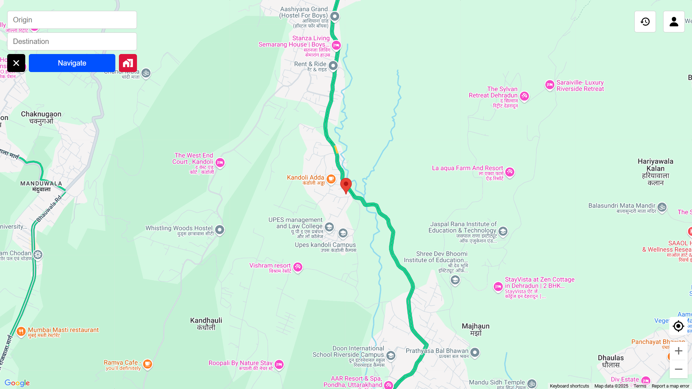
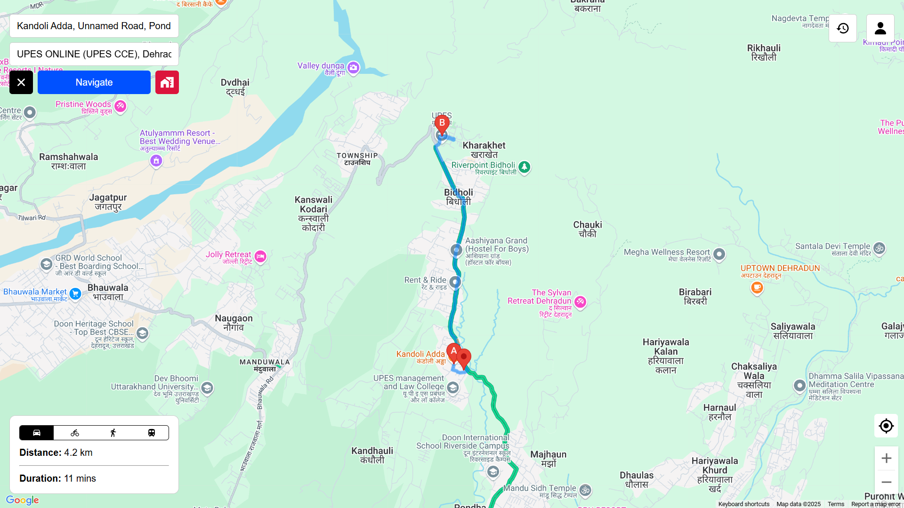
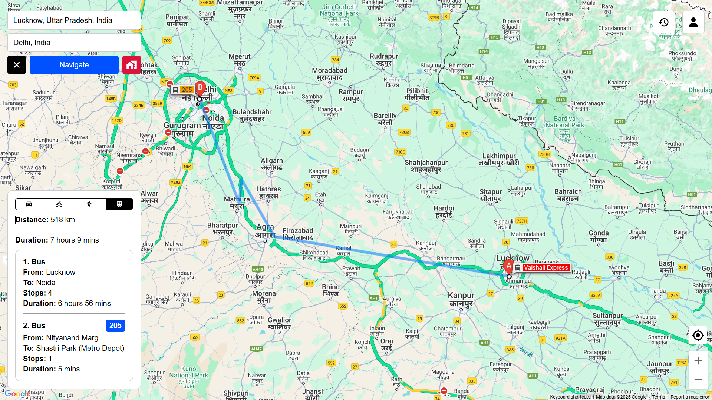
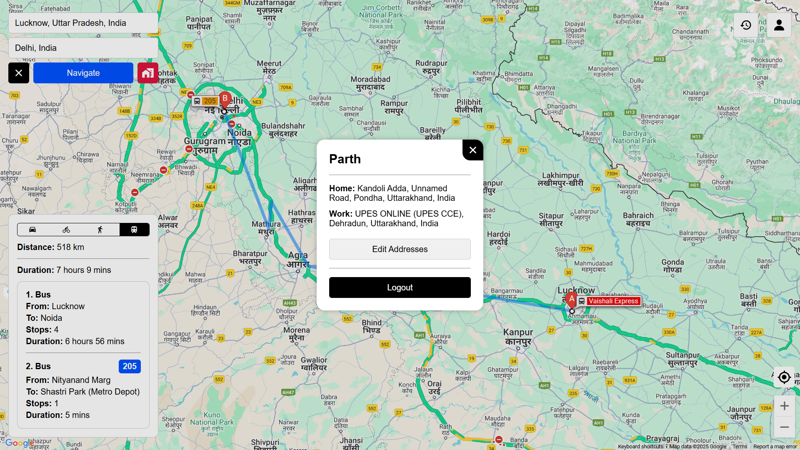
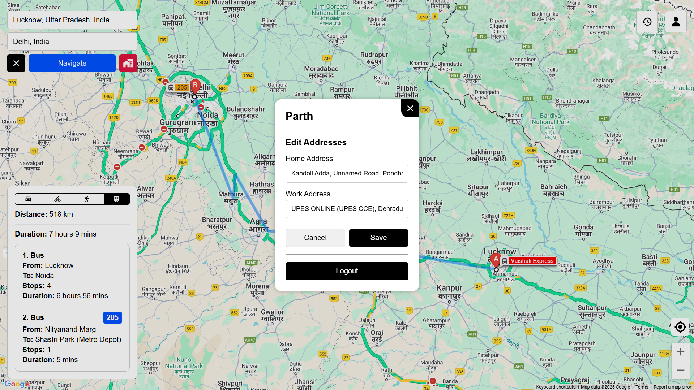
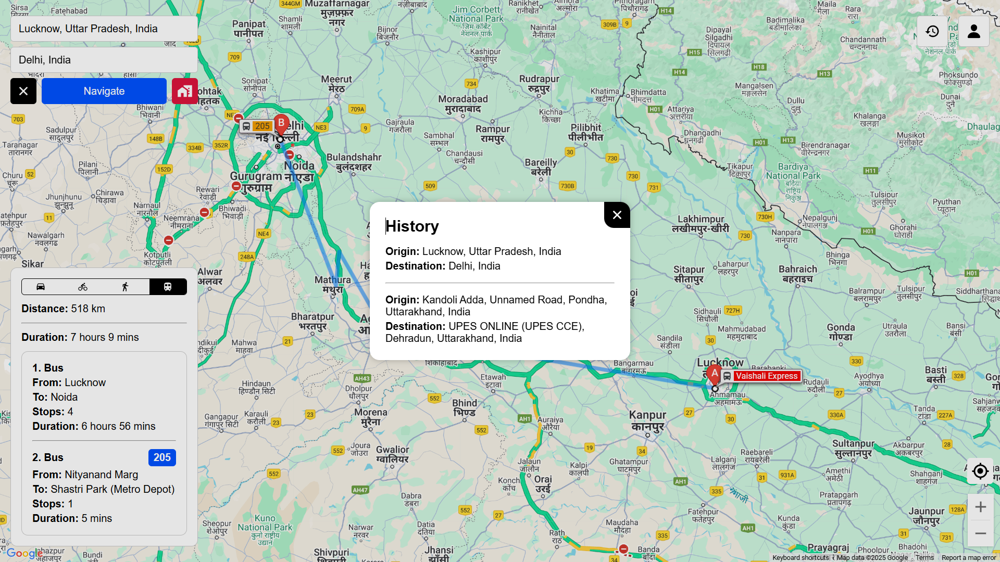
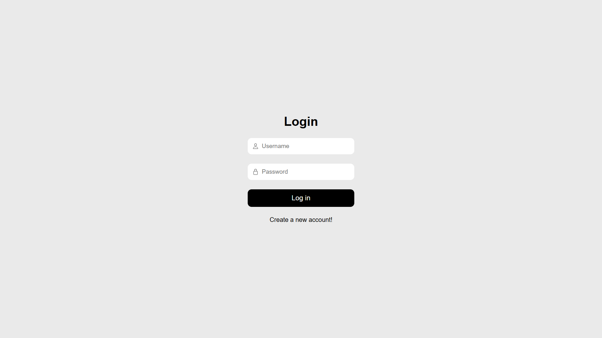

# Commuter App

A real-time location and commute tracking application built with React and Express.js.

## Project Overview

Commuter is a web application that allows users to:
- Create an account and log in securely
- View and interact with Google Maps
- Search for locations using Google Places Autocomplete
- Track their current location in real-time
- Calculate routes between destinations
- View route details including distance and duration
- Toggle between different transportation modes (Car, Bicycle, Walking, Transit)
- Save home and work addresses for quick navigation
- View detailed transit instructions when using public transportation
- Access route history for previous trips
- Manage user profile settings

## Tech Stack

### Frontend
- React 19
- Google Maps API (Places, Maps)
- CSS for styling
- JWT for authentication

### React 19 Features Used

- Modern Hooks API
- Suspense for data fetching
- useContext for global state management
- `flushSync` for controlled state updates
- `use` hook for promise resolution

### Backend
- Express.js
- MongoDB with Mongoose
- JWT for authentication
- Bcrypt for password hashing

## Setup Instructions

### Prerequisites
- Node.js (v16+)
- MongoDB (running locally or connection string)
- Google Maps API key with Places API enabled

### Backend Setup

1. Clone the repository
   ```bash
   git clone https://github.com/yourusername/Commuter.git
   cd Commuter/commuter-backend
   ```

2. Install dependencies
   ```bash
   npm install
   ```

3. Create a `.env` file in the `commuter-backend` directory with:
   ```
   JWT_TOKEN=your_secret_key_here
   ```

4. Start MongoDB locally
   ```bash
   mongod --dbpath /path/to/your/data/directory
   ```

5. Start the backend server
   ```bash
   node server.js
   ```

The backend server will run on http://localhost:5000.

### Frontend Setup

1. Navigate to the frontend directory
   ```bash
   cd ../commuter
   ```

2. Install dependencies
   ```bash
   npm install
   ```

3. Create a `.env` file in the `commuter` directory with:
   ```
   VITE_API_KEY=your_google_maps_api_key
   ```

4. Start the development server
   ```bash
   npm run dev
   ```

The frontend will be available at http://localhost:5173 (or another port chosen by Vite).

## Google Maps API Setup

This project requires a Google Maps API key with the following APIs enabled:
- Maps JavaScript API
- Places API

To set up your Google Maps API key:

1. Go to the [Google Cloud Console](https://console.cloud.google.com/)
2. Create a new project (or select an existing one)
3. Navigate to APIs & Services > Library
4. Enable the Maps JavaScript API and Places API
5. Create an API key under APIs & Services > Credentials
6. Restrict the API key as needed for security
7. Add the API key to your frontend `.env` file as `VITE_API_KEY`

## Project Structure

```
Commuter/
├── commuter/                 # Frontend
│   ├── public/
│   ├── src/
│   │   ├── Components/       # Shared components
│   │   │   ├── Search.jsx    # Places search component
│   │   │   └── useUser.jsx   # User context
│   │   ├── Login/            # Login related components
│   │   │   ├── Login.jsx
│   │   │   └── Login.css
│   │   ├── Map/              # Map related components
│   │   │   ├── Map.jsx       # Main map component
│   │   │   └── Map.css
│   │   ├── App.jsx           # Main application component
│   │   ├── main.jsx          # Application entry point
│   │   └── index.css         # Global styles
│   ├── package.json
│   └── vite.config.js
│
└── commuter-backend/         # Backend
    ├── middleware/
    │   └── authenticateToken.js  # JWT authentication middleware
    ├── models/
    │   └── User.js           # User model with history and addresses
    ├── routes/
    │   ├── auth.js           # Authentication routes
    │   └── history.js        # Route history endpoints
    ├── server.js             # Express server setup
    └── package.json
```

## Features

- User authentication (register/login)
- Interactive map interface
- Places search with autocomplete
- Current location tracking
- User profile and statistics

## User Account Features

- **Account Management**: Users can create accounts and log in securely
- **Address Management**: Save home and work addresses for quick navigation
- **Route History**: View a history of previous routes taken
- **Profile Settings**: Personalize your commuting experience


## Screenshots

### Map Interface

*The main App screen showing the Map of the current location, search fields, and multiple controls.*

### Daily Commute Navigation

*Navigation showing the route between home and work addresses with traffic information.*

### Transit Mode Navigation

*Detailed public transportation route with step-by-step transit instructions.*

### Account Details

*User account details showing saved home and work addresses.*

### Address Configuration

*Form for setting and updating home and work addresses using Google Places Autocomplete.*

### Route History

*History of previous routes taken by the user, sorted by most recent.*

### Login Interface

*The login and registration screen for user authentication.*

---